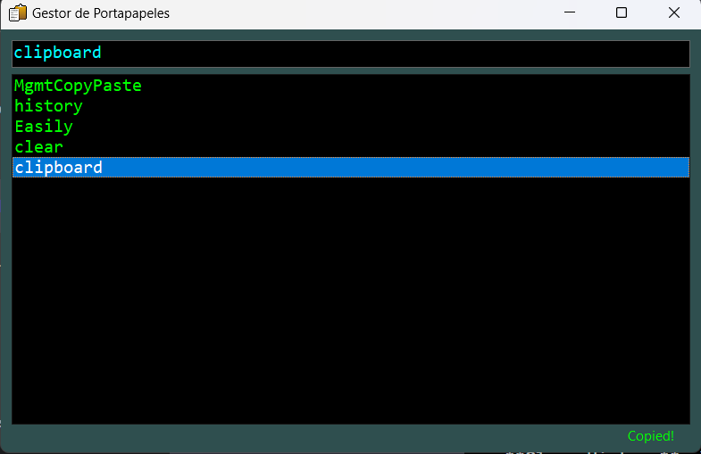

# MgmtCopyPaste

MgmtCopyPaste is a clipboard management utility designed to simplify copy-paste operations. With this utility, you can keep track of clipboard history and easily copy previous items back to the clipboard. The application is developed in C# and uses WinForms for the graphical user interface.

## Features

- **Clipboard History**: Keeps a history of items that you've copied to the clipboard.
- **Pinning**: Allows you to pin important clipboard items so they remain accessible.
- **Clear History**: You can clear the clipboard history with a simple click.
- **Double-Click to Copy**: Easily copy any item from the history back to the clipboard with a double-click.
- **Visual Feedback**: Provides visual feedback when an item is copied to the clipboard.

## Getting Started

### Prerequisites

- .NET Framework

### Building

- Open the solution in Visual Studio.
- Build the solution to produce the `MgmtCopyPaste.exe` executable.

### Usage

1. Run `MgmtCopyPaste.exe`.
2. The application will start monitoring the clipboard.
3. Any text you copy will be added to the clipboard history which can be viewed in the main window.
4. You can double-click on any item in the history to copy it back to the clipboard.
5. Right-clicking on an item in the history will show a context menu allowing you to pin the item or clear the clipboard history.

## Screenshots

